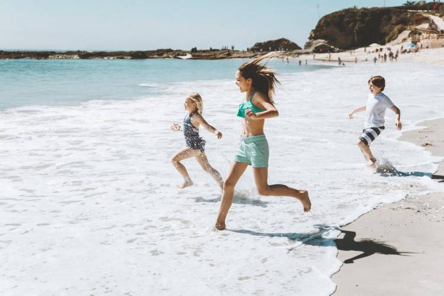

# Introduction

<b>MagicInpainter 3.0</b>  is image processing tool for inpaint, mask selection and objects removal of small and medium sized objects from photos. Starting with version 3.0 GPU optimized image inpaint algorithms are used. 

<b>Inpaint</b> (or image reconstruction) is a process of filling in the missing parts of images in a natural way, preserving textures and background so that a person is not able to spot the difference. 
 

There are two main groups of modern image inpaint methods:

- **Image processing algorithms (called also traditional)**
- **Deep learning using neural networks with CNNs, etc. (called also AI methods)**

Both approaches have pros and cons for different areas of application. MagicInpainter 3.0 uses the first group of methods. Below I have shown that while in certain cases, especially when reconstructing complex features, AI methods clearly have the edge, for others like reconstruction and generation of textures the traditional inpaint methods are still more reliable. 

# Inpaint Algorithms

<b>MagicInpainter 3.0</b> fills in the pixels from the missing noisy regions using the data from the undamaged area in the same image, also called <b>low noise</b> area. Training, preprocessing or additional images are not necessary. Inpaint is done only with extracting valid image data from the image area with <b>low noise</b> and then using this data to fill in areas with <b>high noise</b>. This is done with assigning each pixel or group of several pixels to the so-called <b>image keys</b> or as some researchers call them <b>image features</b>. Image keys are extracted from the non-noisy pixels neighborhood and then used to find the best match for the corresponding noisy pixels. Thus, like many other problems for inpaint we use a <b>feature space</b> composed from the collected before <b>valid image keys</b>. So the process of extracting image keys can be called constructing the feature space and inpaint is then can be called the process of <b>decreasing image noise</b> using this feature space. 

Some of the parameters of the inpaint (available in Settings):

- **Low noise and high noise area**
We first separate image into two regions – <b>low noise</b> and <b>high noise</b>, then we take pixels from the low noise area and fills in the pixels from the high noise area going from outside to inside. Choosing the objects for removal is done manually with applying a mask, MagicInpainter 3.0 has <b>Eraser Button</b> allowing to apply such mask over any part of the image. 

- **Max. Noise**
In some cases pixels close to the image edges or with too many noise around can distort results. This parameter is given in percents and controls which feature keys from the low noise area can be used during the inpaint, <b>valid image keys</b> are these for which is fullfiled:

- **Zoom In/Out** For images with higher resolution generated feature keys are too many,
it makes it more difficult and too computationally expensive to find a best match. To resolve this MagicInpainter provides the <b>Zoom In</b> and <b>Zoom Out</b> buttons and one parameter called <b>Max. Distance</b>. 

- **Inpaint Radius** This radius controls the size of the area around each noise pixel, it would be used from the inpaint filter. Usually this is called filter <b>kernel radius</b> and is given in pixels. Filter has kernel matrix with size <b>[2R+1]</b> X <b>[2R+1]</b>. Using larger inpaint radius means that pixels further away will participate in the reconstruction but just increasing <b>R</b> does not always means better quality.

# Reconstructing Image Patterns

<b>MagicInpainter 3.0</b> uses inpaint filters to find the best replacement candidates for the noisy pixels . For the calculation of inpaint pixels replacements sometimes are used gradient based methods, the most well-known of these is the Navier-Stokes method, described in the paper <i>"Navier-Stokes, Fluid Dynamics, and Image and Video Inpainting"</i>, by Bertalmio, Marcelo, Andrea L. Bertozzi, and Guillermo Sapiro, published in 2001. This was further improved with the so called <b>Fast Marching Method</b>, representing successive fill-in from outside to inside of the noisy region, described in another famous paper "An Image Inpainting Technique Based on the Fast Marching Method" by Alexandru Telea, published in 2004 
[[See]](https://www.researchgate.net/publication/238183352_An_Image_Inpainting_Technique_Based_on_the_Fast_Marching_Method). These are the only inpaint algorithms provided currently by OpenCV (See https://docs.opencv.org/3.4/df/d3d/tutorial_py_inpainting.html). My tests however showed that these methods, even as sufficiently fast are good only for small linear scratches and failed to reproduce the picture patterns even for small rectangular inpaint regions.

One other approach is to use GPU optimized variations of the <b>Normalized Cross Correlation</b> calculation methods. These methods are widely used in the Forensic Tampering detection and elsewhere, [[See]](https://isas.iar.kit.edu/pdf/SPIE01_BriechleHanebeck_CrossCorr.pdf). The idea is to divide the image in blocks and to estimate the cross correlation as described in the paper <i>"A Scaling Robust Copy-Paste Tampering Detection for Digital Image Forensics"</i> [[See]](https://www.researchgate.net/publication/300079866_A_Scaling_Robust_Copy-Paste_Tampering_Detection_for_Digital_Image_Forensics), with the normalized cross correlation coefficient as given by:

Similar approach can be applied but in reverse, instead of searching for forged content to reconstruct already known masked regions.   However, one drawback is that it is quite computational expensive, even with the proposed optimizations. One other optimization is called the <b>Fast Template Matching</b> method as described in [this](http://scribblethink.org/Work/nvisionInterface/vi95_lewis.pdf) paper , but there are many others. An open research in <b>MagicInpainter 3.0</b> is how to further improve the inpaint algorithms to work with bigger resolutions and inpaint radius (see <b>Future Work</b> section below). 

# Test Results

For removing medium sized object from some real-life photos like beach photos, inpaint quality is comparable with the AI apps available on net (after several passes):

|  |   |  | 
|---|---|---| 
| *<b>Original Image, 862x400</b>* | *<b>MagicInpainter 3.0, R15</b>* | *<b>SnapEdit, pass 2</b>* |

|  |   |  | 
|---|---|---| 
| *<b>Original Image, 750x500</b>* | *<b>MagicInpainter 3.0, R25</b>* | *<b>SnapEdit, pass 2</b>* |

See Also: 
 
[Tests with Textures](test/TexturesResults.md) 
 
[Image Tampering Test](test/InpaintChallenge1.md) 

# Limitations

MagicInpainter 3.0 works very well with textures and other pictures but data from other photos is not used and reconstruction of complex features, especially in photos with large sizes, may not be correct. For images with higher resolution, when noise area is large, reconstruction would be too slow, several repeats of “zoom and mask” would be necessary to fill in the missing content. Currently application is limited to pictures with 512x512 size.

# Future Work
In comming releases there would be several improvements:

- **GPU performance** - several optimizations are possible for the GPU to work even faster, also search algorithms can be greately improved

- **Images with larger resolution**
Optimization algorithms used in MagicInpainter 3.0 become sometimes too slow and unstable for images with sizes bigger than <b>512x512</b> pixels. One other limitation is that inpaint radius can not exceed <b>64</b> pixels, which currently requires several inpaint passes. 

- **Processing several images**
MagicInpainter 3.0 is currently limited to single photos.

- **Use AI and deep learning to speed up algorithms and optimal inpaint radius selection**
Assist inpaint algorithms with AI for classification, automation of algorithms type and optimal radius size selection. Used here inpaint algorithms can be combined with various neural networks models, especially in the cases when inpaint involves complicated features and big resolution, speed can be also significantly improved. 

Following research areas are also interesting for me:

<ul>
  <li>Video reconstruction </li>
  <li>Textures and artificial images generation</li>
  <li>Noise removal</li>
  <li>Noise Detection</li>
  <li>Deblur</li>
  <li>Image Tampering Analysis</li>
  <li>Superposition</li>
  <li>Superresolution</li>
  <li>Stable Diffusion</li>
</ul> 

Noise removal for example can be done with improving image quality using partial inpaint and weights coefficients rather than filling in the missing data with masks having only two values.

# Update

With version <b>3.0.2</b> there is no limitation of the image sizes!

# Release

<b>MagicInpainter 3.0 </b>can be installed from: 
|CPU Version (<b>3.0.2.153</b>)|  [MagicInpainter.msi](install/MagicInpainter.msi)|
|---|---|
|GPU Version (<b>3.0.2.153</b>) | [MagicInpainterGpu.msi](install/MagicInpainterGpu.msi)|
|User Manual| [Magic Inpainter 3.0.pdf](docs/MagicInpainter3.0.pdf)|

<b>MagicInpainter 3.0</b> is free for personal and non-comercial use. It is provided in two versions for CPU amd GPU. I strongly recommend using the GPU version, it works better and faster, But for this you need NVIDIA GTX or RTX video card with CUDA support (10x,11x). I tested the GPU app successfully on (GTX1050,RTX2070,RTX3050TI and RTX3060), with CUDA 10.1, 10.2 and 11.8 runtime. If you install the GPU version there is option in Settings to switch back to CPU.

This version is limited to pictures with max size of 512x512.
 

<b>If you do not have NVIDIA GPU card with CUDA support (GTX or RTX) install the CPU version of the application (GPU version will not work!).</b>
 

<b>MagicInpainter 3.0</b> and all related source and documentation is provided under GNU GPLv3 public license.

Supported OS:  <b>Window 7/Vista/10/11 x64</b>

  

For introduction please see: https://youtu.be/RXDDdDnvNPY 

  