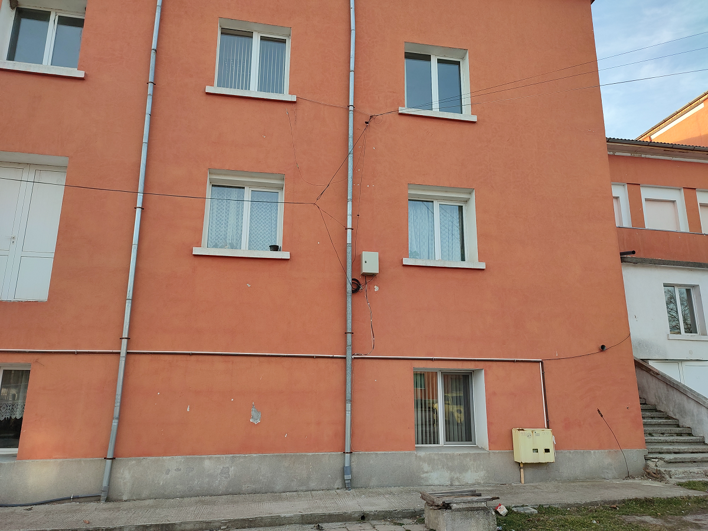
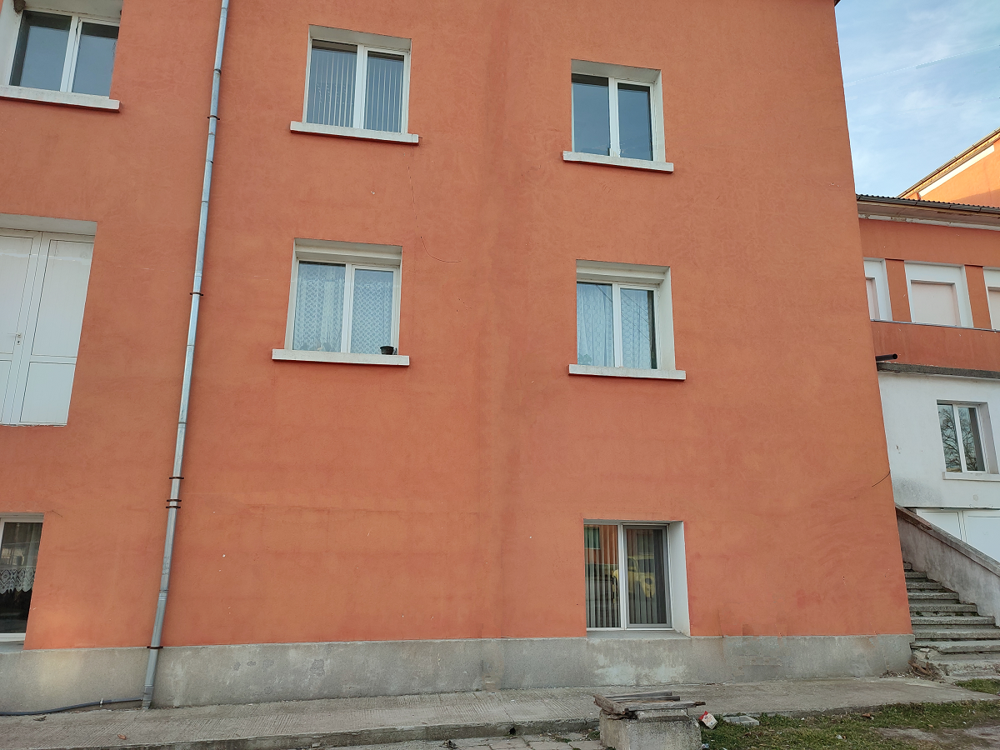
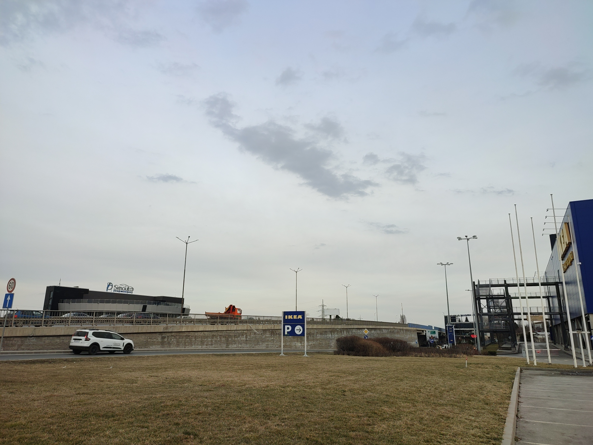
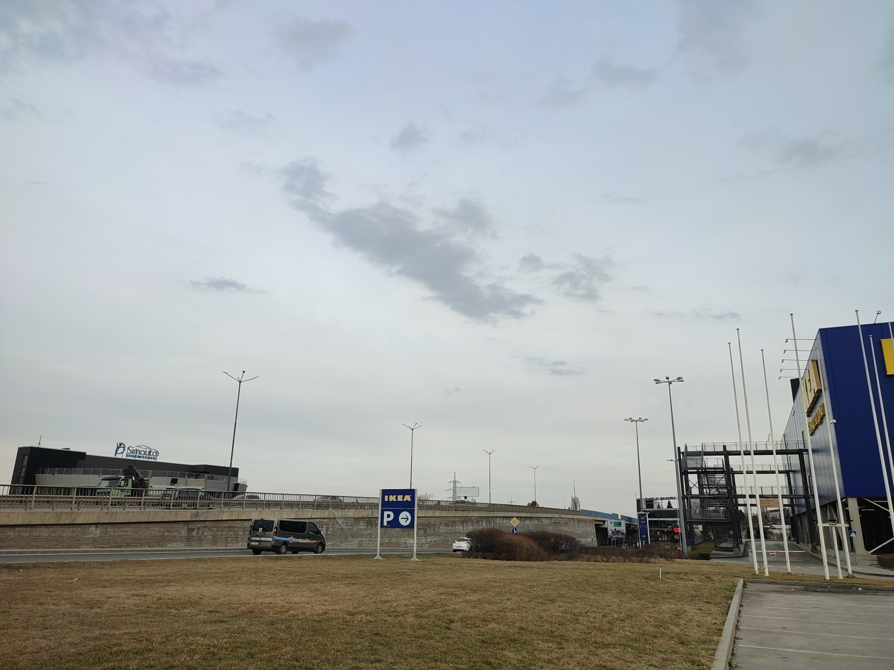
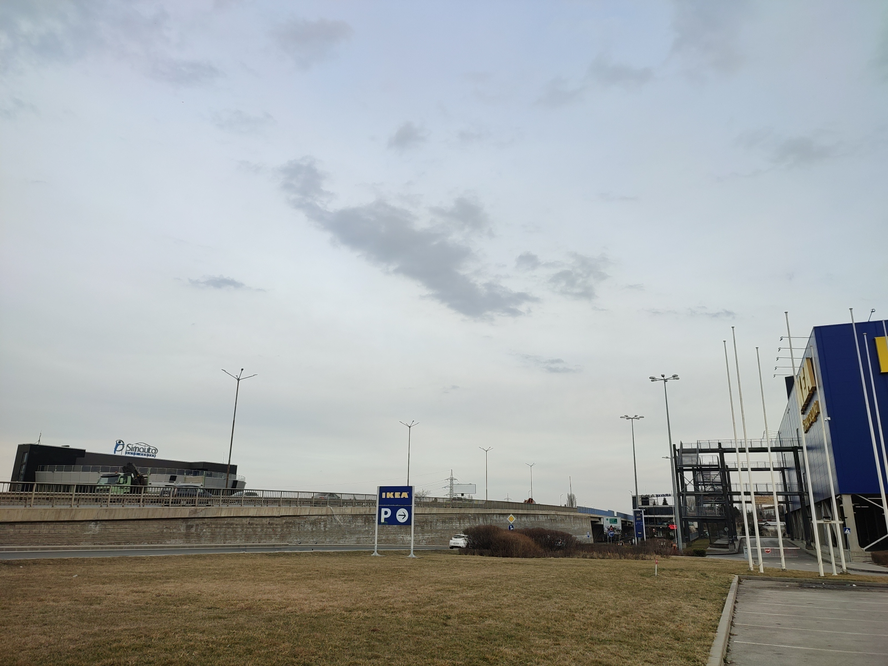
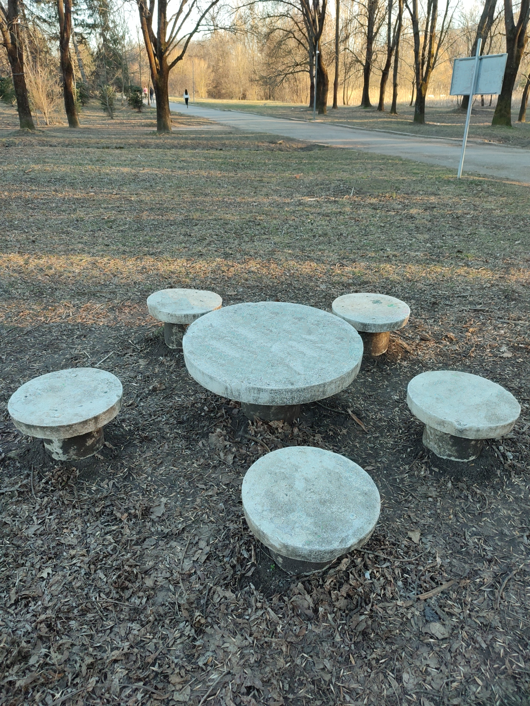
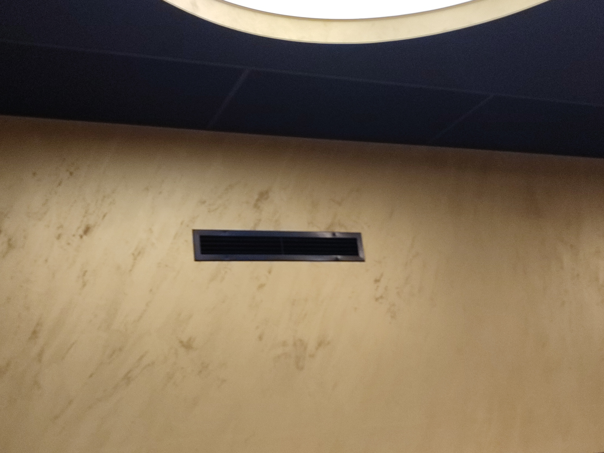
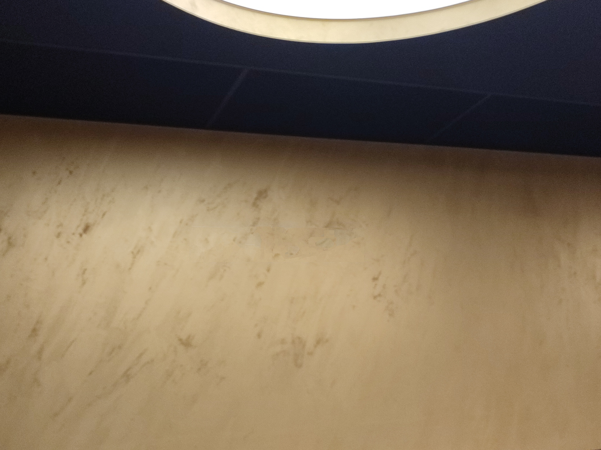
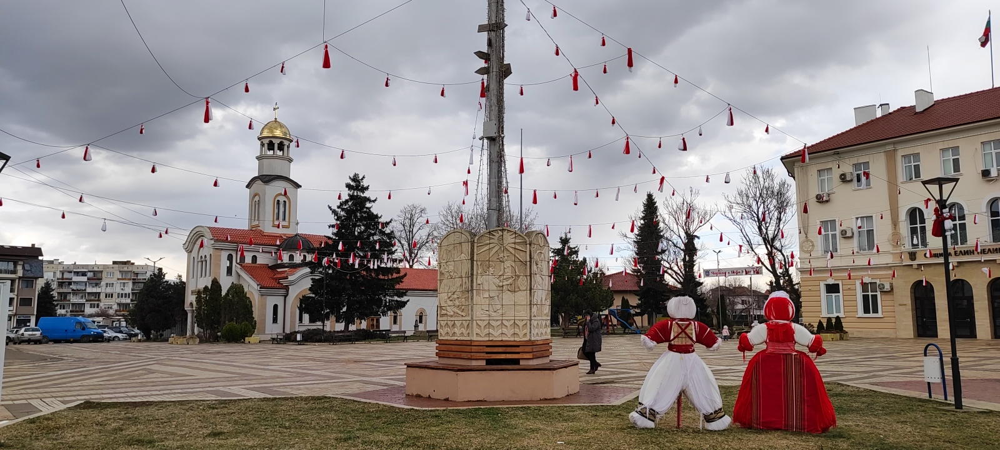
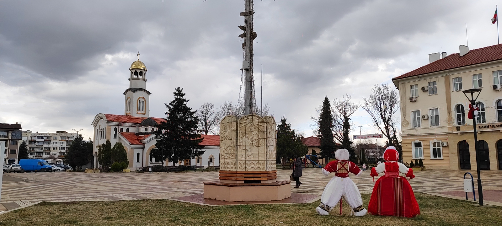

# Inpaint Challenge Set

This is a set of several images that can be used to test DL tampering detection methods. One of the image is real and the other one has inpainted regions. Purpose is to detect the one that is modified. All images are uncompressed, in PNG format so that there is no compression loss.

|  |   
|---|---|
| *<b>Wall Original, 1200x900</b>* | *<b>Wall Inpainted, 1200x900</b>* |

|  |   
|---|---|
| *<b>Road Original, 1600x1200</b>* | *<b>Road Inpainted, 1600x1200</b>* |

|  |   
|---|---|
| *<b>Road Original, 1600x1200</b>* | *<b>Road Inpainted, 1600x1200</b>* |

|  |   
|---|---|
| *<b>Park Original, 1200x1600</b>* | *<b>Park Inpainted, 1200x1600</b>* |

|  |   
|---|---|
| *<b>Park Original, 1600x1200</b>* | *<b>Park Inpainted, 1600x1200</b>* |

|  |   
|---|---|
| *<b>Wall Original, 1600x1200</b>* | *<b>Wall Inpainted, 1600x1200</b>* |

|  |   
|---|---|
| *<b>City Original, 1600x720</b>* | *<b>City Inpainted, 1600x720</b>* |

