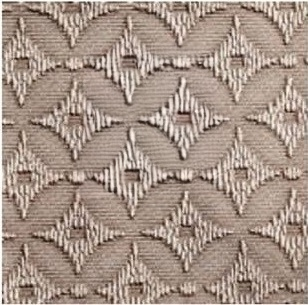
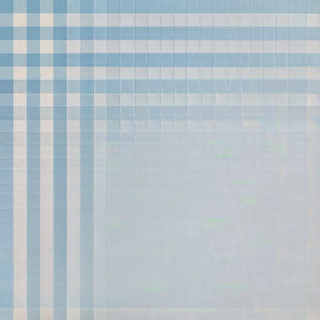
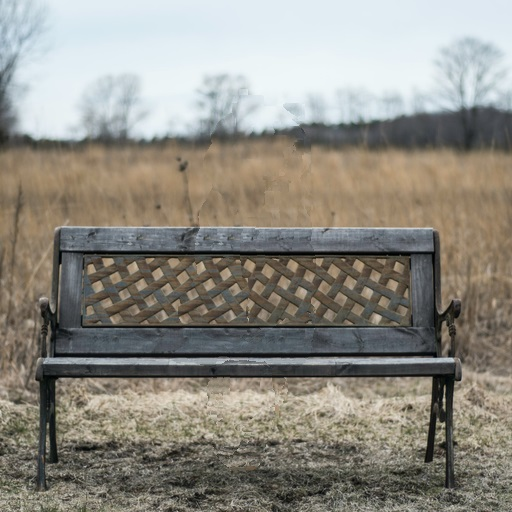

# Test with Textures

I compared results I managed to obtain with OpenCV(4.7.0) (with cv.INPAINT_NS and cv.INPAINT_TELEA), for simple textures with small inpaint regions, results from <b>MagicInpainter 3.0</b> are much better:

|  |   |  | 
|---|---|---| 
| *<b>Texture, 400x400</b>* | *<b>MagicInpainter 3.0, R15</b>* | *<b>OpenCV, R15,NS</b>* |

I also compared inpaint of texture images with some of the AI assisted applications that I found on the net. For small inpaint area, Inpaint app (from https://theinpaint.com) weren’t able to cope very well, but SnapEdit (https://snapedit.app) and ClipDrop (https://cleanup.pictures) showed good results (both are claiming to use AI). Still if we look closely will see that these AI apps have made some minor errors.

|  |   |  | 
|---|---|---| 
| *<b>Texture, 308x305</b>* | *<b>MagicInpainter 3.0, R32</b>* | *<b>OpenCV, R 20,NS</b>* |
|  |   |  | 
| *<b>InpaintApp</b>* | *<b>SnapEdit</b>* | *<b>CleanUp</b>* |

|  |   |  | 
|---|---|---| 
| *<b>Texture, 200x200</b>* | *<b>MagicInpainter 3.0, R5</b>* | *<b>SnapEdit</b>* |

|  |   |  | 
|---|---|---| 
| *<b>Texture, 178x178</b>* | *<b>MagicInpainter 3.0, R5</b>* | *<b>CleanUp</b>* |

Problems of AI apps with textures becomes more obvious when inpaint region becomes bigger and placed at the edges, while <b>MagicInpainter 3.0</b> works fine even in some very extreme cases:

|  |   |  | 
|---|---|---| 
| *<b>Texture, 640x640</b>* | *<b>MagicInpainter 3.0, R15</b>* | *<b>CleanUp</b>* |

|  |   |  | 
|---|---|---| 
| *<b>Texture, 400x400</b>* | *<b>MagicInpainter 3.0, R15</b>* | *<b>SnapEdit</b>* |

|  |   |  | 
|---|---|---| 
| *<b>Texture, 400x400</b>* | *<b>MagicInpainter 3.0, R15</b>* | *<b>SnapEdit</b>* |

Some of the recent AI libraries, like the famous HuggingFace Diffusers trained on almost <b>6 billlion images</b> (see: https://huggingface.co/runwayml/stable-diffusion-inpainting) also have quality issues. For example here is the best I could to produce with removing the dog and using the COLAB example from the link:

|  |   |  | 
|---|---|---| 
| *<b>Original Image, 512x412</b>* | *<b>MagicInpainter 3.0, R45-50</b>* | *<b>HuggingFace Diffusers</b>* |

These tests shows that MagicInpainter 3.0 preserves precisely the texture patters without penalty from the inpaint area size and algorithm can be used for textures generation. While AI darkens or lighten the deeper inpaint area and in the third example is unable to reproduce patterns.

My tests show that AI apps are optimized more for real-life photos and are not precise enough for inpaint of vector textures. The reason for this is the heuristics nature of the neural networks, they make errors during the initial inpaint and errors are later incremented while go deeper in the inpaint region. For real-life photos these errors are not usually noticeble because there is no strict repetition of the patterns.  

